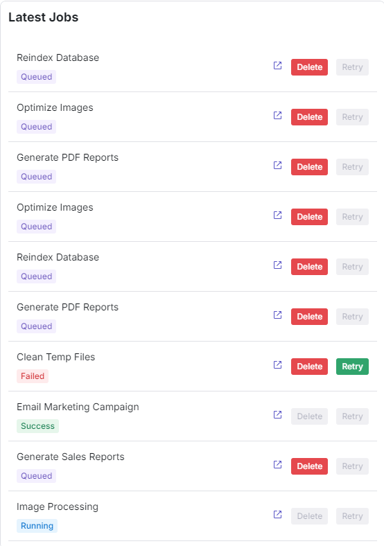

# Job Tracker

[Live Demo](https://job-tracker-mu.vercel.app/)

Job Tracker is a Job Management System (JMS) handles the execution of multiple types of Jobs.

## Table of content:

- [Project Description](#project-description)
- [Stack and Frameworks](#tech-stack)
- [Features](#features)
- [Dependencies](#dependencies)
- [High-level system design](#system-design)
- [Setup](#setup)
- [Api Documentation](#api-documentation)
- [Assumptions and Shortcuts](#assumptions-and-shortcuts)
- [Technical Debt](#technical-debt)
- [Requirements/Screenshots](#screenshots)

## Project Description:

### Overview:

This project is an online Job Tracker that allows users to handles the execution of multiple types of Jobs and Admins to control the environment, examples of such jobs could be
loading data into a Data Warehouse, performing indexing of some files content, or sending
emails/notifications. At any time, a Job entered to the JMS has one of four statuses: QUEUED,
RUNNING, SUCCESS, FAILED. The Job Management System has multiple clients which create
different types of jobs.

## Tech Stack:

- Next.js
- Typescript
- React
- Node.js
- Tailwind CSS
- Radix UI
- Git
- Axios API
- Prisma
- Recharts
- Zod
- Neon DB
- Postman

## Features:

- Filtering
- Sorting
- Charts
- Loading Skeletons
- Spinners
- Mobile responsiveness
- REST API
- Server side Validation
- Client side Validation

## Code Style:

- Prettier
- Pascal Case

## System Design:
`{
+------------------------+ +--------------------------+
| | Fetch | |
| Job Listing Component | <-------- | Mock API (Express)|
| | | |
+------------------------+ +--------------------------+
|  
 |  
 v  
+--------------------------+  
| |  
| |
| JobTracker Dashboard |  
| |  
+--------------------------+  
 |  
 v  
+--------------------------+  
| |  
| Job Details Modal |  
| |  
+--------------------------+
}`

### Key Interactions

Job Listing:

- Fetches job data from the API.
- Displays jobs with color-coded statuses.
- Provides retry/delete options.

Job Details Modal:

- Fetches job details from the API when a job is clicked.
- Provides actions (retry, delete) based on job status.

Retry/Delete Functionality:

- Triggered from either the Job Listing, Job Page or Modal.
- Sends appropriate API calls to retry or delete jobs.

## Setup:

1. Clone this repository to your local machine.
2. Run `npm install` to install the required dependencies.
3. Rename .env.example to .env
4. Run `npm run dev` to start the web server.
5. Setup and start Postgresql

## API Documentation:

### **1. Create Job**

- **Endpoint**: `POST /api/jobs`
- **Description**: Creates a new job in the Job Management System.
- **Request Body**:
- **title** (string, required): The title of the job.
- **description** (string, required): The job's description.

- **Example Request**:

  ```json
  {
    "title": "Data Processing",
    "description": "Processing customer data."
  } `

  ```

- **Response**:

  - **201 Created** -- Returns the created job object.
  - **Example**:

    `{
  "id": 1,
  "title": "Data Processing",
  "description": "Processing customer data.",
  "status": "QUEUED",
  "createdAt": "2024-09-20T10:00:00Z",
  "updatedAt": "2024-09-20T10:00:00Z"
}`

- **Error Responses**:

  - **400 Bad Request** -- If validation fails.
  - **Example**:

    `{
  "error": [
    {
      "path": ["title"],
      "message": "Title is required"
    }
  ]
}`

---

### **2\. Retry Job**

- **Endpoint**: `PATCH /api/jobs/:id`

- **Description**: Updates the status of a specific job, typically to retry a failed job.

- **Request Parameters**:

  - **id** (integer, required): The ID of the job to update.

- **Request Body**:

  - **status** (string, required): The new status of the job (must be a valid status like `RUNNING`, `QUEUED`, etc.).

- **Example Request**:

  `{
  "status": "RUNNING"
}`

- **Response**:

  - **200 OK** -- Returns the updated job object.
  - **Example**:

    `{
  "id": 1,
  "title": "Data Processing",
  "description": "Processing customer data.",
  "status": "RUNNING",
  "createdAt": "2024-09-20T10:00:00Z",
  "updatedAt": "2024-09-21T12:00:00Z"
}`

- **Error Responses**:

  - **400 Bad Request** -- If the input validation fails.
  - **404 Not Found** -- If the job with the provided ID does not exist.
  - **Example**:

    `{
  "error": "Invalid job"
}`

---

### **3\. Delete Job**

- **Endpoint**: `DELETE /api/jobs/:id`

- **Description**: Deletes a job by its ID if it's in a `QUEUED` or `FAILED` status.

- **Request Parameters**:

  - **id** (integer, required): The ID of the job to delete.

- **Response**:

  - **200 OK** -- Returns a success message or an empty object.
  - **Example**:

    `{
  "message": "Job successfully deleted."
}`

- **Error Responses**:

  - **404 Not Found** -- If the job with the provided ID does not exist.
  - **Example**:

    `{
  "error": "Invalid job"
}`

---

### **4. Query Job Status**

- **Endpoint**: `GET /api/jobs/:id`
- **Description**: Retrieves the details of a specific job, including its status.

- **Request Parameters**:

  - **id** (integer, required): The ID of the job to query.

- **Response**:

  - **200 OK** – Returns the job object with its current status.
  - **Example**:
    ```json
    {
      "id": 1,
      "title": "Data Processing",
      "description": "Processing customer data.",
      "status": "QUEUED",
      "createdAt": "2024-09-20T10:00:00Z",
      "updatedAt": "2024-09-20T10:00:00Z"
    }
    ```

- **Error Responses**:
  - **404 Not Found** – If the job with the provided ID does not exist.
  - **Example**:
    ```json
    {
      "error": "Invalid job"
    }
    ```

---

## **Assumptions and Shortcuts**

### **Assumptions Made:**

1. **Single Job Type**: It is assumed that all jobs are of a single type, and additional job types will be added later if necessary. This simplifies the initial design but may require future adjustments.

2. **Basic Validation**: Input validation is handled using a schema validation library (e.g., Zod). While this is adequate for the current functionality, it does not cover all edge cases (e.g., lengthy descriptions or special characters).

### **Shortcuts Taken:**

1. **Limited Error Handling**: Error handling is basic and does not cover all potential issues (e.g., network errors or server-side validation errors). Future iterations should enhance error handling to improve user experience.

2. **Minimal API Documentation**: The API documentation is concise but lacks comprehensive examples for all edge cases. Expanding the documentation would improve developer usability.

---

## **Technical Debt**

### **1. Reasons for Technical Debt:**

- **Simplicity Over Robustness**: The focus on a minimal viable product (MVP) led to shortcuts in areas such as error handling and validation, which may hinder scalability and maintainability in the future.

### **2. Addressing Technical Debt in the Future:**

- **Enhance Error Handling**: Implement a more comprehensive error-handling strategy that captures various failure scenarios and provides user-friendly feedback.

- **Dynamic Configuration**: Move from hardcoded values to a configuration-driven approach, allowing easier adjustments to job statuses and their visual representations.

- **Expand API Documentation**: Provide comprehensive API documentation with detailed examples and scenarios to facilitate easier onboarding for other developers.

- **Implement Automated Testing**: Introduce unit and integration tests to ensure code reliability and ease of future modifications, which would help mitigate the risks associated with technical debt.

## Requirements:

#### 1- As a JMS Admin, I am able to see a listing of (up to) the last 10 Jobs that were created in the JMS and see their statuses (preferably, different Job statuses are color-coded)

### Listing



### Job List


#### 2- As a JMS Admin, I can click on any Job in the listing and see its details (in a Modal window)

### Job Page


### Job Modal


### 3- As a JMS Admin, from the Job listing, I can retry a FAILED Job

#### Shown in the list picture

### 4- As a JMS Admin, from the Job listing, I can delete a Job if its status is QUEUED orFAILED

#### Shown in the list picture

### 5- As a JMS Admin, from the Job details Modal, if the Job has the status FAILED, I can retry it or delete it

#### Failed job modal


### 5- As a JMS Admin, from the Job details Modal, if the Job has the status QUEUED, I can delete it

#### Queued job modal


